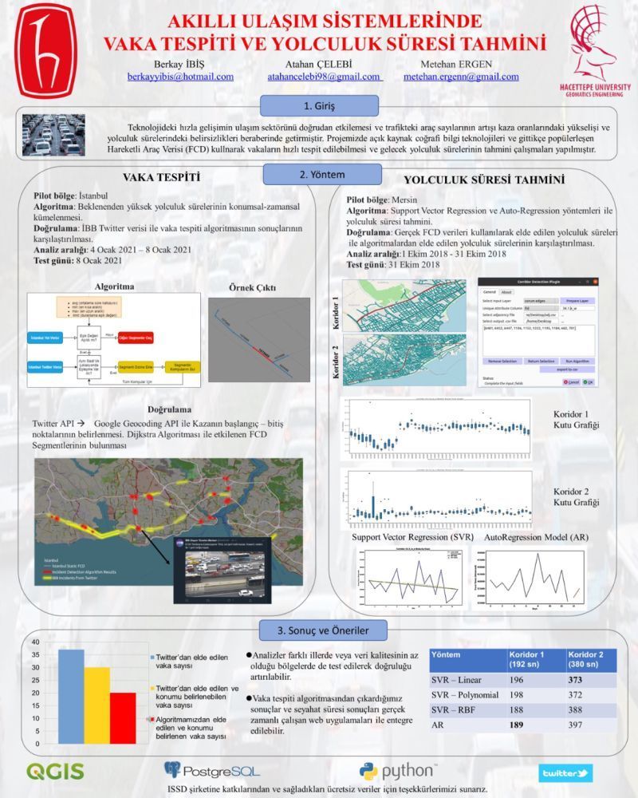

# accident_prediction
Thanks to Metehan Ergen, our <a href='https://medium.com/about-roads/creating-a-plugin-for-corridor-ordering-on-qgis-398fa295870c'>adjacent matrix plugin</a> which is implemented for our project.
## 2 example diagrams
https://drive.google.com/file/d/1E53RCB5vhiUF9HOBxKrF65MvVyaqNqkF/view?usp=sharing

